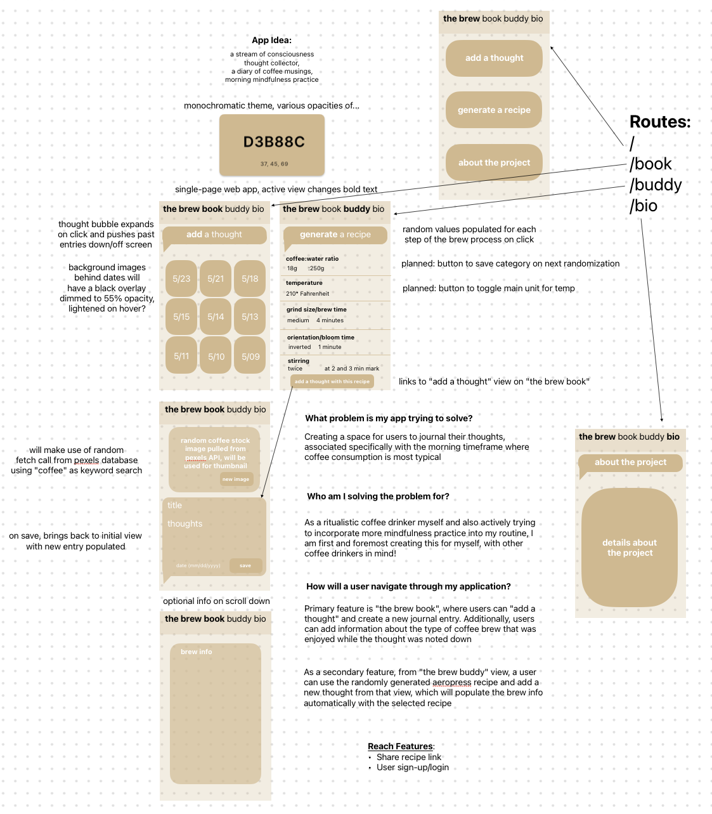

*The Brew Buddy*

The Brew Buddy is the ritualistic coffee drinker's morning companion. As a brew buddy, it provides a handy aide for experimenting with new AeroPress coffee brewing recipes via a randomizer for each aspect of the brewing process. As a brew book, it provides a space for users to engage in a daily journaling exercise, centered around the period of time during which coffee is consumed.

The Pexels API (https://www.pexels.com/api/) is used to provide a thumbnail image for each journal entry. 

To start it up locally, use the command "npm run dev" from the terminal after navigating into the project directory, and then navigate to the listed localhost port (e.g. 127.0.0.1:5173)