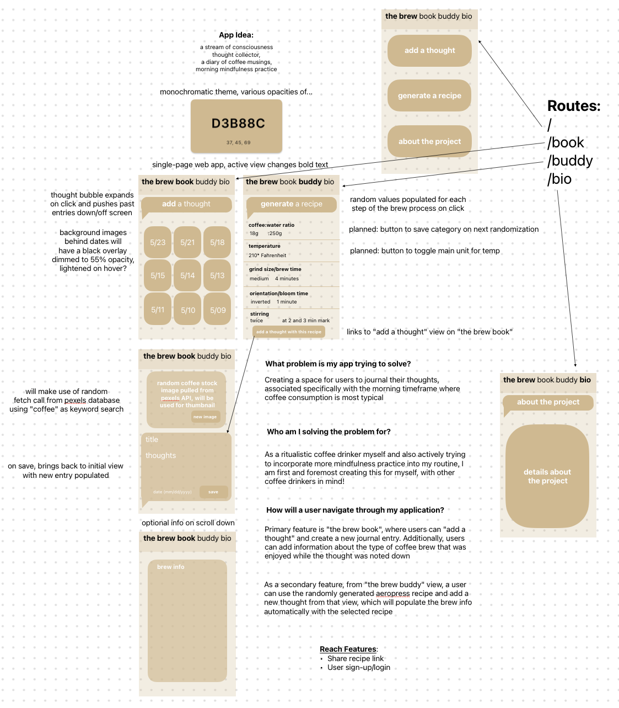

# The Brew Buddy

## Description
The Brew Buddy is the ritualistic coffee drinker's morning companion. 

The Buddy feature provides the indecisive or adventurous coffee drinker with a way to explore new recipes for brewing coffee, specifically using an AeroPress brewing device. A randomizer adjusts variables in each stage of the brewing process so that users can enjoy a different coffee recipe with every cup. 

>Future Feature: There will be a shortcut to populating a new journal entry with the recipe generated in the brew notes. 

Using the Book feature, it provides users with a space to engage in a daily journaling exercise, centered around the period of time during which coffee is typically consumed. Users can create new journal entries and view previous ones, along with notes on how that day's coffee was made/tasted. 

The Brew Buddy caters to coffee drinkers specifically as it aims to solve the problem of inconsistent mindfulness practice by associating it with a daily activity. The time during which coffee is typically made/consumed can be occupied with mindful thinking, and this tool provides a method for users to not only document those thoughts but to also help with breaking the anti-routine of making coffee the same every day.

## API

Initially, the Pexels API (https://www.pexels.com/api/) was planned to be used to provide a thumbnail image for each journal entry, however due to CORS issues the API was replaced with cats (from CATAAS, found at https://cataas.com/). 

>Future Feature: The Pexels API or related coffee image will be populated after the project is converted to full-stack functionality, and a back-end will be set up to receive the images with CORS middleware.

## Running the App Locally

1. Clone the repository to your local machine: 
    `git clone git@github.com:kevncrypting/the-brew-buddy.git`

2. Navigate to the cloned repository: 
    `cd the-brew-buddy`

3. Install the dependencies: 
    `npm install`

4. Start the application: 
    `npm run preview`

The application will start on http://localhost:5173.

## Deployed Application
You can access the deployed application at: https://the-brew-buddy.onrender.com/

## Application Flow and Wireframes

The application has the following main screens:

- Book Screen: Shows a list of all journal entries, as well as a button to add a new journal entry. The subsequent screen displays a cat-related thumbnail image pulled from the CATAAS API (which can be regenerated if the user wants a different image), an area to document thoughts, and an area to talk about the morning's brew.

- Buddy Screen: Shows a recipe generator for brewing coffee using an AeroPress device. Users can repeatedly generate new random recipes, 

>Future Feature: Users will be able to choose to keep certain randomized values while regenerating others.

- Bio Screen: Shows information about the author and the purpose of the project.